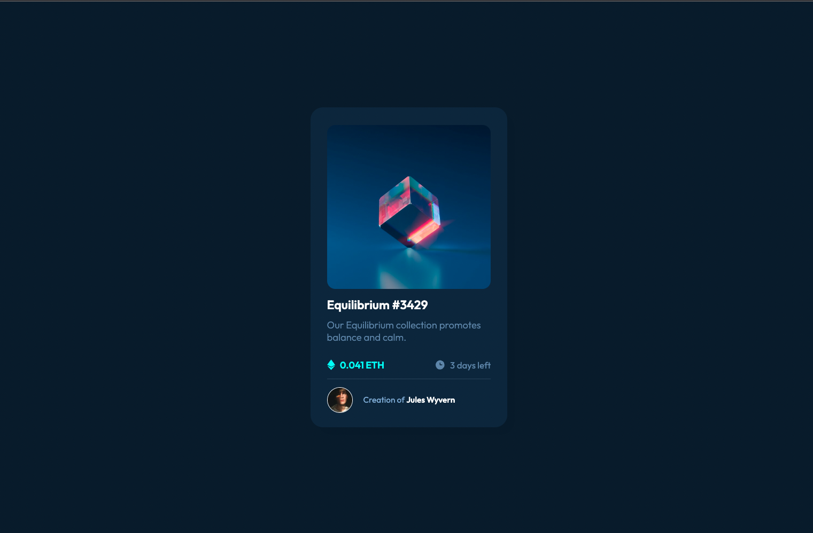

# Frontend Mentor - NFT preview card component solution by Matias Frascino

This is a solution to the [NFT preview card component challenge on Frontend Mentor](https://www.frontendmentor.io/challenges/nft-preview-card-component-SbdUL_w0U). Frontend Mentor challenges help you improve your coding skills by building realistic projects.

## Table of contents

- [Overview](#overview)
  - [Screenshot](#screenshot)
  - [Links](#links)
- [My process](#my-process)
  - [Built with](#built-with)
- [Author](#author)

## Overview
This is a project in which a simulation of an NFT card is created. To accomplish this project, I've used shadows for a 3D effect and implemented hover effects, which stand out in the project.

### Screenshot

### Links

- Solution URL: [https://github.com/MatiasFrascino/nft-preview-card](https://github.com/MatiasFrascino/nft-preview-card)
- Live Site URL: [https://matiasfrascino.github.io/nft-preview-card/](https://matiasfrascino.github.io/nft-preview-card/)

## My process

### Built with

- Semantic HTML5 markup
- CSS custom properties
- Flexbox
- Grid
- Mobile-first workflow

## Author

- GitHub - [Matias Frascino](https://github.com/MatiasFrascino)
- Frontend Mentor - [@MatiasFrascino](https://www.frontendmentor.io/profile/MatiasFrascino)
- Linkedin - [Matias Frascino](https://www.linkedin.com/in/matias-sebastian-frascino-60332316b/)
